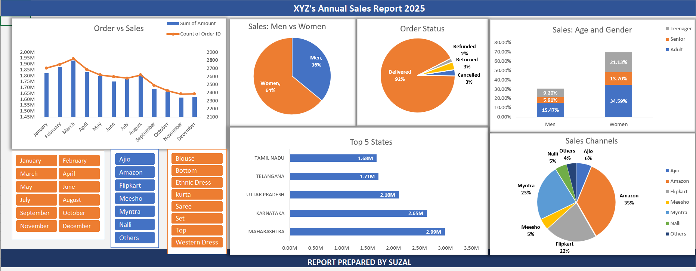

<h1 align="center">📊 XYZ Store Sales Analysis Dashboard</h1>

This Excel-based dashboard presents an interactive **Annual Sales Report** for XYZ Store, designed with dynamic slicers, pivot tables, and advanced Excel formulas to help users explore and analyze data effortlessly.

---

## 🔍 Dashboard Overview

The dashboard gives a clear and insightful view of XYZ Store’s sales performance across different months, sales channels, and product categories. It is built for interactive analysis with easy-to-use slicers and visualizations.

---

## 🎯 Key Features

- 📆 **Month Slicer**  
  Filter and view sales for any month individually or in combination.

- 🛒 **Sales Channel Slicer**  
  Analyze sales by channel: Amazon, Flipkart, Myntra, etc.

- 👕 **Item Category Slicer**  
  View item-specific performance: T-Shirts, Sarees, Suits, etc.

- 📈 **Dynamic Pivot Charts**  
  Auto-update visualizations based on selected slicers.

- 🧮 **Advanced Excel Formulas**  
  Used for calculating KPIs, dynamic ranges, and sales summaries.

- 🧹 **Data Cleaning & Processing**  
  Raw data transformed into meaningful, analysis-ready format.

---

## 🛠 Tools & Techniques Used

- Microsoft Excel
- Pivot Tables & Pivot Charts
- Slicers for interactivity
- Advanced Formulas (`SUMIFS`, `IF`, `TEXT`, `XLOOKUP`, etc.)
- Conditional Formatting
- Data Normalization and Cleaning

---

## 📷 Preview

  

---

## 📁 File

- `XYZ_Store_Analysis.xlsx` – The complete dashboard file

---

## 🧠 Insights Highlighted

- Monthly sales trend comparison
- Best performing item categories
- Sales channel contribution
- Dynamic comparisons through multi-slicer filters

---

## 🚀 How to Use

1. Download the `.xlsx` file.
2. Open in **Microsoft Excel (2016 or later recommended)**.
3. Use slicers to filter by **Month**, **Channel**, and **Item**.
4. Observe charts and tables updating in real time.

---

## 💡 Future Enhancements

- Add Year-over-Year growth comparison
- Incorporate Profit & Cost analysis
- Auto-refresh with Power Query

---

## 🙌 Acknowledgements

Dashboard designed and created by Suzal.  
For suggestions or improvements, feel free to open an issue or connect on GitHub.

---

## 📜 License

This project is released under the [MIT License](LICENSE).
